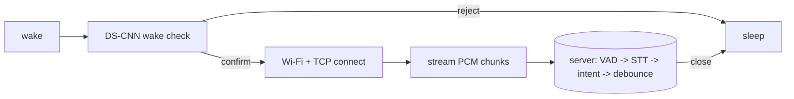

# SimonSays — ESP32-S3 Wake-Word Voice Daemon

A small, low-power voice appliance for the ESP32-S3. The device waits for a wake word,
streams audio to a server that transcribes it and matches an intent, and returns to sleep
when the server closes the connection. The wake-word model is a custom int8 DS-CNN written
in portable C (no WakeNet, no TFLite runtime); the server does speech-to-text with a
pluggable backend (deterministic stub or whisper.cpp).

The design principle throughout is a **portable core** (`firmware/core/`) that is compiled
both for the device and for host unit tests, so the on-device numeric path is validated on
a normal computer and proven bit-for-bit identical to the off-device training reference.

---

## Contents

- [How it works](#how-it-works)
- [Repository layout](#repository-layout)
- [Quick start](#quick-start)
- [Hardware](#hardware)
- [Firmware](#firmware)
- [Server](#server)
- [Wake-word training framework](#wake-word-training-framework)
- [Container deployment](#container-deployment)
- [Testing](#testing)
- [Project status](#project-status)
- [Third-party components](#third-party-components)
- [License](#license)

---

## How it works

One cycle of the daemon:

1. The device wakes (power-on, an analog sound trigger, or a button).
2. It captures a short window from the INMP441 microphone and runs the trained int8 DS-CNN
   over its log-mel features. A cheap energy floor rejects silence before the model runs.
3. On a confirmed wake word it brings up Wi-Fi and opens a TCP socket to the server.
4. It streams raw PCM (16 kHz / 16-bit / mono) as chunked HTTP.
5. The server segments utterances (VAD), transcribes them (STT backend), matches an
   intent, and — after a debounce window with no new speech — closes the connection.
6. The device sees the socket close and goes back to sleep.



The full loop — chunked-HTTP client, socket server, VAD/STT/intent/debounce
connection-cut, and the DS-CNN — runs as host-testable code, and an end-to-end loopback
test drives the real portable client over a TCP socket into the server.

---

## Repository layout

```
.
├── firmware/                 ESP-IDF project (ESP32-S3)
│   ├── core/                 Portable, host-tested logic (compiled for device + host)
│   │   ├── src/              ringbuf, power, fsm, app, nn kernels, dsp (fft/melspec),
│   │   │                     kws, kws_model, kws_frontend, net (stream client/proto)
│   │   └── include/core/
│   ├── main/                 app_main.c entry, Kconfig, codegen'd kws_model_data.h
│   ├── port/esp/             Device backends: mic_i2s, net_wifi, net_socket, power_esp
│   ├── sdkconfig.defaults     No-PSRAM default board, USB-Serial/JTAG console
│   └── sdkconfig.psram        Overlay for PSRAM (…R2) boards
├── server/                   Host C server (STT + intent + debounce)
│   ├── src/                  http_ingest, vad, stt_stub, stt_whisper, intent,
│   │                         debounce, session, config, main
│   └── include/server/
├── kws-framework/            Off-device training / quantization / codegen (Python + numpy)
├── tests/host/              Host unit tests + committed C↔Python parity fixture
├── tools/host/               WAV simulator + POSIX transport + demo client
├── deploy/                   Containerfile, pod manifest, deployment README
├── CMakeLists.txt            Host build (core + server + tools + tests)
└── Makefile                  make test / build / clean
```

The ESP-IDF SDK is expected under `esp/esp-idf/` and keeps its own git history; it is
git-ignored by this repository.

---

## Quick start

Host tests (no hardware required):

```sh
make test
```

Run the server locally (scripted stub backend) and stream a WAV through it:

```sh
cmake -S . -B build && cmake --build build
./build/server/simonsays-server --port 8080 --script "light on" &
./build/tools/host/simonsays-client path/to/audio.wav 127.0.0.1 8080
```

Build and flash the firmware (requires ESP-IDF; see [Firmware](#firmware)):

```sh
. esp/esp-idf/export.sh
idf.py -C firmware set-target esp32s3
idf.py -C firmware -p /dev/ttyACM0 flash monitor
```

---

## Hardware

| Part | Role | Notes |
|---|---|---|
| ESP32-S3 Super Mini | MCU | 4 MB flash; many boards also have 2 MB PSRAM (`…R2`). Firmware supports both. |
| INMP441 | Microphone | I²S digital MEMS; used for the wake word and streaming. |
| Analog sound trigger (optional) | Low-power wake | e.g. LM393 digital-out or MAX9814 analog-out. Needed for true deep-sleep wake (the digital I²S mic cannot wake the CPU from deep sleep). |
| Push button (optional) | Manual wake | EXT1 wake source. |

### INMP441 wiring (default pins)

| INMP441 | ESP32-S3 GPIO | Kconfig |
|---|---|---|
| SCK / BCLK | GPIO4 | `SIMONSAYS_I2S_BCLK_GPIO` |
| WS / LRCL  | GPIO5 | `SIMONSAYS_I2S_WS_GPIO` |
| SD / DOUT  | GPIO6 | `SIMONSAYS_I2S_DIN_GPIO` |
| L/R | GND (left slot) | — |
| VDD | 3V3 | — |
| GND | GND | — |

---

## Firmware

The firmware wires the portable core to ESP-IDF (INMP441 I²S capture, Wi-Fi STA, lwip TCP
transport, deep-sleep backend). Details and per-hook notes are in
[firmware/README.md](firmware/README.md).

```sh
. esp/esp-idf/export.sh                 # ESP-IDF v6.1-dev, vendored under esp/esp-idf
idf.py -C firmware set-target esp32s3
idf.py -C firmware build
idf.py -C firmware -p /dev/ttyACM0 flash monitor
```

Configuration (Wi-Fi credentials, server address, mic pins, VAD thresholds) is set via
`idf.py -C firmware menuconfig` → **SimonSays configuration**
([firmware/main/Kconfig.projbuild](firmware/main/Kconfig.projbuild)). The committed
defaults are placeholders (`your-ssid`, `192.168.1.10`); set real values before an
end-to-end test. With placeholders the device boots and the wake model runs, and the
Wi-Fi connect fails gracefully.

Power modes are selected by `APP_POWER_MODE` in
[firmware/main/app_main.c](firmware/main/app_main.c): `STAY_AWAKE` (default, never sleeps),
`DRYRUN` (simulated sleep cycle), and `REAL` (production deep sleep with EXT1 wake).

---

## Server

The server is a small host C program: a thin POSIX socket accept loop over host-tested
modules (chunked-POST ingest, VAD, STT, intent match, debounce connection-cut). STT is
pluggable behind a single `stt_backend_t` interface.

Scripted stub backend (deterministic; good for demos and CI):

```sh
./build/server/simonsays-server --port 8080 --script "light on" --script "light off"
```

whisper.cpp backend (real speech-to-text; opt-in at build time):

```sh
cmake -S . -B build -DSIMONSAYS_WITH_WHISPER=ON -DWHISPER_ROOT=/usr/local
cmake --build build --target simonsays-server
./build/server/simonsays-server --port 8080 --whisper-model models/ggml-base.en.bin
```

If built without `SIMONSAYS_WITH_WHISPER`, passing `--whisper-model` prints a warning and
falls back to the scripted stub. Full instructions: [deploy/README.md](deploy/README.md).

---

## Wake-word training framework

`kws-framework/` trains and quantizes the DS-CNN off-device (Python + numpy only) and
codegens a C header consumed verbatim by the firmware and the host parity test. The Python
quant/kernels are bit-exact mirrors of the C, so trained weights transfer without skew.

```sh
python kws-framework/tools/train.py --epochs 80 --out firmware/main/kws_model_data.h
```

The shipped model is trained on a synthetic separable dataset for demonstration; retrain on
real recorded wake-word features (same `(X, y)` interface) for production. See
[kws-framework/README.md](kws-framework/README.md).

---

## Container deployment

`deploy/Containerfile` is a multi-stage build producing a slim, non-root runtime image.
The default image builds the scripted-stub server; `--build-arg WITH_WHISPER=1` fetches and
builds whisper.cpp.

```sh
# Stub image
podman build -f deploy/Containerfile -t localhost/simonsays-server:latest .
podman run --rm -p 8080:8080 localhost/simonsays-server:latest --script "light on"

# Pod (publishes :8080 to the host for the device to stream to)
podman play kube deploy/simonsays-pod.yaml
```

Whisper models are kept out of the image and mounted as a volume. Full details:
[deploy/README.md](deploy/README.md).

---

## Testing

The host suite builds the portable core exactly as the firmware does and runs 23 test
suites (18 C + 5 Python):

```sh
make test
```

Highlights:

- **Portable core**: ring buffer, power/sleep FSM, application loop.
- **Numeric wake stack**: int8 quant/kernels, radix-2 FFT, log-mel front-end, DS-CNN.
- **C↔Python parity**: a committed golden fixture asserts the on-device C engine
  reproduces the off-device Python int8 reference bit-for-bit.
- **Front-end**: the full PCM → log-mel → int8 → decision path.
- **Streaming**: chunked-HTTP protocol/client and the server modules.
- **End-to-end loopback**: the real portable client over a TCP socket into the server,
  asserting the wake → stream → cut loop.

---

## Project status

Implemented and tested on host, with the firmware building and running on an ESP32-S3:

- Portable core (FSM, ring buffer, power abstraction, session runner).
- Numeric wake-word stack (quant/kernels, FFT, log-mel, DS-CNN) with C↔Python parity.
- Off-device training / quantization / codegen framework.
- Streaming loop: chunked-HTTP client and socket server with VAD, STT, intent, and
  debounce connection-cut.
- Device integration: INMP441 I²S capture, Wi-Fi STA, lwip TCP transport.
- Trained DS-CNN wired into the on-device wake hook (runs on hardware).
- whisper.cpp STT backend behind the pluggable interface.
- Container packaging (Containerfile + pod manifest).

Not yet done / left as follow-ups:

- Training the wake model on real recorded audio (the shipped weights are a synthetic
  demo).
- The analog sound-trigger wake sensor for true low-power deep sleep (firmware supports
  `REAL` mode; the digital I²S mic cannot itself wake the CPU from deep sleep).
- The debug/visualisation dashboard described in the architecture document.

---

## Third-party components

- **ESP-IDF** (Apache-2.0) — vendored under `esp/esp-idf/`, not part of this repository's
  history.
- **whisper.cpp** (MIT) — optional STT backend, fetched at container build time or linked
  from a local install; not vendored here.

---

## License

Released under the [MIT License](LICENSE).
