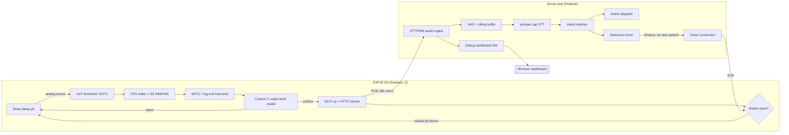
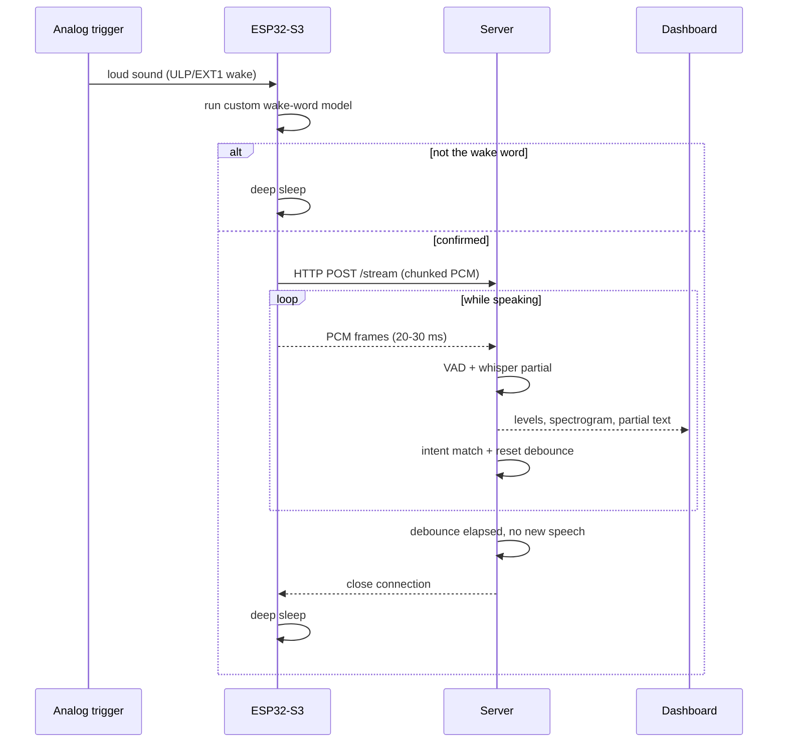
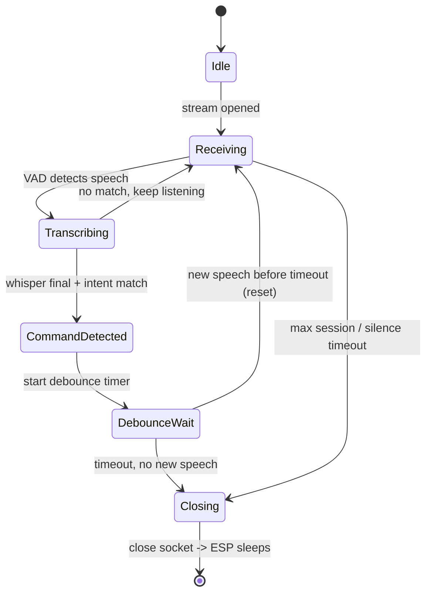
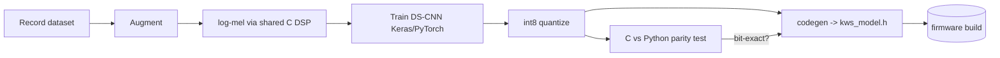

# SimonSays — ESP32‑S3 Wake‑Word Voice Daemon

Architecture & implementation plan.

> Status: **Phases 1–4 implemented.** The portable core (state machine, ring buffer,
> power/sleep abstraction, session runner), the numeric wake‑word stack (int8
> TFLite‑compatible quant/kernels, radix‑2 FFT, log‑mel front‑end, DS‑CNN forward + wake
> decision), the off‑device training/quantization/codegen framework, **and the full
> streaming loop (chunked‑HTTP client + socket server with VAD/STT/intent/debounce
> connection‑cut)** are implemented as **host‑testable code** with a passing local suite
> (22 suites: 17 C, 5 Python). A host **WAV simulator** runs the exact device DSP over
> real audio, a committed **C↔Python parity fixture** proves the on‑device C engine
> reproduces the off‑device Python int8 reference **bit‑for‑bit**, and an **end‑to‑end
> loopback test** drives the portable streaming client over a real TCP socket into the
> server and asserts the wake→stream→cut loop. Real trained weights and on‑device
> Wi‑Fi/socket/mic glue follow the roadmap in §11.

### Confirmed build constraints (from user)

- **No PSRAM board is the default target**, but firmware must **support both** PSRAM and
  non‑PSRAM variants (compile‑time/runtime feature‑gated, no hard dependency on PSRAM).
- **Deep sleep is "soft" / dry‑run first.** The sleep+wake cycle is fully modelled behind a
  power abstraction with three modes — `STAY_AWAKE` (initial: never actually sleeps),
  `DRYRUN` (simulates a sleep→wake reboot without powering down, for host testing), and
  `REAL` (device‑only `esp_deep_sleep`). Development starts in `STAY_AWAKE`.
- **Test‑first:** every piece of hand‑written logic has a local host test and the suite
  must pass. Portable core lives in `firmware/core/` and is compiled both for the device
  and for host tests (see §6.2, §13).
- **Git used throughout**, committed in logical chunks. The ESP‑IDF SDK under `esp/esp-idf`
  keeps its own git history and is git‑ignored by this repo.

---

## 1. Goal (restated)

A tiny, low‑power voice appliance:

1. ESP32‑S3 sits in **deep sleep** drawing microamps.
2. A cheap **analog sound trigger** wakes the CPU on loud sound (via ULP / RTC GPIO).
3. The CPU runs a **custom‑trained wake‑word model (pure C, no WakeNet)** to confirm the
   real wake word. False alarm → straight back to sleep.
4. On confirmation the device brings up Wi‑Fi and **streams raw audio over HTTP** to a
   server.
5. The **server** (C, in a Podman pod) runs **whisper.cpp** for speech‑to‑text, matches an
   **intent**, dispatches the action, and — after a **debounce window** with no new
   speech — **closes the connection**.
6. The ESP sees the socket close and returns to **deep sleep**.

Plus: a **debug/visualisation dashboard** and a **wake‑word training framework**, all
containerised and kept as small as possible.

---

## 2. Hardware & the one critical constraint

### 2.1 Bill of materials

| Part | Role | Notes |
|---|---|---|
| ESP32‑S3 Super Mini | MCU | **4 MB flash.** Most Super Minis use `ESP32‑S3FH4R2` → 4 MB flash **+ 2 MB PSRAM**. **Confirm your PSRAM** — it changes the audio‑buffer strategy. |
| INMP441 | Main mic | I²S digital MEMS, 24‑bit. Used for wake‑word + streaming. |
| **Analog sound trigger** | Low‑power wake | See below. Options: LM393 sound module (digital out) *or* analog mic‑amp (MAX9814 / electret + op‑amp envelope) into ADC. |
| On‑board RGB LED (WS2812) | Status | Sleep / listening / streaming / error. |
| (optional) push button | Manual wake | EXT1 wake source, also handy for provisioning. |

### 2.2 The INMP441 + deep‑sleep problem (must‑read)

The INMP441 is a **digital I²S** microphone. Reading it requires the I²S peripheral and a
running CPU/DMA. **The ULP (FSM or RISC‑V) cannot practically read an I²S mic**, and in
true deep sleep the I²S peripheral is off. Therefore the INMP441 alone **cannot** provide
the "loud sound wakes me" stage.

**Solution — two‑sensor wake:** add a tiny *analog* sound path just for the wake trigger:

- **Simplest (no ULP code):** an LM393 sound‑detector module. Its digital output goes high
  on sound above a pot‑set threshold. Wire it to an RTC‑capable GPIO and use **EXT1
  deep‑sleep wake**. Zero firmware for the trigger; threshold set by the module's trimpot.
- **Smarter (recommended):** an analog mic‑amp (e.g. MAX9814 AGC + electret, or the analog
  envelope of a MEMS analog mic) into an **ADC1 / RTC ADC channel**. The **ULP‑RISC‑V**
  periodically samples the ADC, applies a **threshold with hysteresis + N‑of‑M counting**
  to reject clicks, and only then wakes the main CPU. Far fewer false wakes, tunable in
  firmware, still microamp‑class average current.

Either way the flow is: **analog trigger → CPU wakes → power up INMP441 (I²S) → run custom
wake‑word model → confirm or sleep.**

> If you would rather avoid a second sensor, the fallback is **light sleep** with I²S DMA
> kept alive and the wake‑word model running continuously (few‑mA class, not µA). You said
> deep sleep + ULP threshold, so the two‑sensor design above is the primary plan; light
> sleep is documented as the fallback in §9.

### 2.3 Suggested pin map (to finalise on real board)

| Signal | ESP32‑S3 pin (example) | Notes |
|---|---|---|
| I²S BCLK (SCK) | GPIO ? | to INMP441 SCK |
| I²S WS (LRCLK) | GPIO ? | to INMP441 WS |
| I²S SD (data in) | GPIO ? | from INMP441 SD |
| INMP441 L/R | GND | selects Left channel |
| Analog trigger in | **RTC/ADC1 GPIO** (e.g. GPIO1‑10) | must be RTC‑capable for ULP/EXT1 wake |
| Status LED | GPIO48 (typical Super Mini WS2812) | |
| Button (optional) | RTC GPIO | EXT1 wake |

---

## 3. System overview



### 3.1 Session sequence



---

## 4. Firmware (ESP‑IDF, C)

ESP‑IDF present in workspace: **v6.1‑dev**. Target `esp32s3`.

### 4.1 State machine

`DEEP_SLEEP → WAKE_TRIGGER → CONFIRM(KWS) → {reject→DEEP_SLEEP | confirm→CONNECT} →
STREAM → (server EOF | max‑session timeout | error) → DEEP_SLEEP`

Persist across sleep in **RTC slow memory**: last Wi‑Fi channel + BSSID (fast reconnect),
false‑wake counter, boot count, ULP threshold state.

The state machine is implemented as a **pure reducer** in portable C
(`firmware/core/src/fsm.c`): `fsm_dispatch(event, cause) → action`. It performs **no I/O** —
it only maps `(state, event)` to `(new state, action)`, so it is fully unit‑testable on the
host. The device/host glue layer executes the returned actions (start KWS, connect, stream,
enter sleep). See §13 for the implemented state/event/action tables.

### 4.1a Power / sleep abstraction (soft & dry‑run first)

Sleep is modelled behind a small backend interface (`firmware/core/src/power.c`) with three
modes so we can develop and test the full wake→sleep cycle **without** a device:

| Mode | Behaviour | Use |
|---|---|---|
| `POWER_MODE_STAY_AWAKE` | never sleeps; `enter_deep_sleep` is a no‑op that returns | **initial development** — run the loop while awake |
| `POWER_MODE_DRYRUN` | simulates a sleep→wake reboot: records the sleep, then delivers the next scheduled wake cause and **returns** | host tests, on‑bench dry runs |
| `POWER_MODE_REAL` | device backend calls `esp_deep_sleep_start()` (does not return; wakes as a fresh boot) | production firmware |

A mock backend used by the host tests queues wake causes (`POWER_ON`, `SOUND_TRIGGER`,
`BUTTON`, `TIMER`) so a whole multi‑cycle mission can be replayed and asserted deterministically.

### 4.2 Audio front‑end

- I²S standard mode, **16 kHz, mono, 24‑bit‑in‑32‑bit slot**; shift to 16‑bit PCM.
- Framing: 25–30 ms window, 10 ms hop (Hann/Hamming), pre‑emphasis.
- Features: **log‑Mel spectrogram** (26–40 mel bins) — skip DCT/MFCC, DS‑CNN works on
  log‑mel. FFT via **ESP‑DSP** (Espressif's optimized DSP lib — *not* WakeNet, fine to use)
  or a hand‑rolled radix‑2 FFT.
- **Buffering supports both board variants.** The audio ring buffer
  (`firmware/core/src/ringbuf.c`) works over caller‑provided storage, so it maps to internal
  SRAM on the **no‑PSRAM default board** (smaller buffer, ~KB range) or to PSRAM when present
  (larger ~1 s buffer). No hard PSRAM dependency; buffer size is a compile‑time option.

### 4.3 Custom wake‑word engine (the "no WakeNet" core)

Two pieces, cleanly split:

1. **On‑device inference — 100% custom C, no TFLM, no WakeNet.**
   - Model: small **DS‑CNN** (depthwise‑separable CNN, "Hello Edge" style). Input ≈
     49 frames × 40 log‑mel; output classes `{wake, unknown, silence}`.
   - Size: ~30–50 k params → **~30–50 KB int8**. Trivial for 4 MB flash.
   - Engine implements only the layers we use: `conv2d`, `depthwise_conv2d`,
     `pointwise_conv2d`, folded batch‑norm, ReLU, average‑pool, `dense`, `softmax`, all
     **int8 with requantization** (mirror TFLite integer kernel math so host↔device match
     bit‑exactly). ~500–800 lines of portable C.
   - Weights baked in as a generated C array **or** a small read‑only flash data partition.
2. **Off‑device training framework — ours (see §6).** Training in Python (impractical in
   pure C), export → int8 quantize → **codegen to C weights**. The *device* stays pure C.

> "Custom C framework, no WakeNet" is honoured: the runtime and the whole pipeline are
> ours. Training uses Python only as an offline tool. A **pure‑C training harness** is
> possible but much heavier and is listed as a stretch option in §6.4.

### 4.4 Networking / streaming

- Bring up Wi‑Fi (STA). Fast path: restore channel+BSSID from RTC memory to cut assoc
  time (~1–2 s → few hundred ms).
- **Primary protocol:** `HTTP POST /stream`, `Transfer-Encoding: chunked`,
  `Content-Type: audio/L16;rate=16000;channels=1`. Body = continuous raw PCM. Headers carry
  `X-Device-Id`, `X-Fw`, `X-Wake-Confidence`.
- Server ends the session by **closing the connection**; ESP detects EOF → sleep. Safety:
  device‑side **max‑session timeout** and watchdog.
- **Optional richer path:** WebSocket (server can push partial transcripts / an explicit
  "sleep now" event + debug data). Offered but not required.
- Bandwidth: 16 kHz·16‑bit·mono = **32 KB/s** — negligible.

### 4.5 Power

| State | Approx current | Notes |
|---|---|---|
| Deep sleep (RTC + ULP periodic ADC) | ~10–40 µA | dominated by ULP duty cycle |
| Deep sleep (EXT1 only, no ULP) | ~7–10 µA | LM393 module adds its own draw |
| Wake + KWS confirm | ~40–80 mA, ~200–500 ms | I²S + CPU + DSP |
| Wi‑Fi streaming | ~100–240 mA | minimise session length |

Design lever: **keep the active window short** — the server's debounce cut is what ends it.

### 4.6 Flash budget (4 MB) — proposed partition table

| Partition | Size | Purpose |
|---|---|---|
| bootloader + ptable | ~64 KB | |
| nvs | 24 KB | Wi‑Fi creds, config |
| phy_init | 4 KB | |
| factory app | ~1.5 MB | firmware |
| model (data) | 128–256 KB | wake‑word weights (optional; can also live in app) |
| storage (spiffs/littlefs) | remainder | debug captures, config, logs |

**OTA trade‑off:** dual‑OTA needs 2× app (~3 MB) which is tight with model + storage on
4 MB. Recommendation: **single factory app to start**; revisit OTA only if needed (or move
non‑essential assets to PSRAM/flash storage). Decide in Phase 4.

### 4.7 Firmware source layout

```
firmware/                     # ESP-IDF project
  CMakeLists.txt
  sdkconfig.defaults          # target esp32s3, PSRAM, log level, etc.
  partitions.csv
  main/
    app_main.c                # state machine entry
    power/     deep_sleep.c ulp_glue.c
    audio/     i2s_inmp441.c ringbuf.c
    dsp/       melspec.c fft.c        # <-- shared with host (see §6.2)
    kws/       kws_engine.c kws_model.h(gen)   # <-- shared with host
    net/       wifi.c http_stream.c
    state/     fsm.c
  ulp/         ulp_threshold.c        # ULP-RISC-V ADC threshold program
```

`dsp/` and `kws/` are written **portable** so the exact same C compiles on the host for the
simulator and the C↔Python parity test (§6.3). This is the single most valuable design
choice for fast iteration.

---

## 5. Server (C, Podman) — STT + intent + debounce

### 5.1 Building blocks

| Concern | Choice | Why |
|---|---|---|
| HTTP/WS ingest | hand‑rolled sockets **or** `civetweb` (MIT, single‑file) | tiny, MIT‑friendly. (`mongoose` is smaller but GPL/commercial dual — license note.) |
| STT | **whisper.cpp** (`tiny`/`base`, int8 ggml/gguf) | C/C++, static lib, CPU‑only, quantized models. |
| VAD | simple energy‑based VAD (or webrtcvad) | mark speech vs silence for debounce. |
| Intent | rule/grammar/keyword matcher over transcript | keep it small and explicit; pluggable. |
| Dispatch | webhook / MQTT / exec | fire the recognised action. |

> whisper.cpp is the heaviest piece: the **model file** (~40–150 MB) lives in the container
> image, *not* on the ESP. CPU cost is real but fine on a modest host; GPU optional.

### 5.2 Server state machine (debounce = the connection‑cut logic)



- `debounce_ms` configurable (default ~800–1500 ms of trailing silence after the last
  recognised command).
- Emits structured events to the dashboard throughout.

### 5.3 Server source layout

```
server/
  src/
    http_server.c       # ingest (civetweb or raw sockets)
    stream_handler.c    # session lifecycle, buffering
    vad.c
    stt_whisper.c       # whisper.cpp wrapper
    intent.c            # transcript -> intent
    debounce.c          # timer + connection cut
    dispatch.c          # actions
    dashboard_ws.c      # debug event feed
  third_party/whisper.cpp/
  web/                  # dashboard static assets (see §7)
  Makefile              # static musl build for tiny image
```

---

## 6. Wake‑word training framework (ours)

`kws-framework/` — collect → train → quantize → codegen → verify.

### 6.1 Data collection (reuses the streaming path!)

- A **firmware "capture mode"** streams raw mic audio to the server, which saves WAV — so
  you record your wake word **through the real mic + real front‑end**, matching deployment
  acoustics. Also record negatives: general speech, TV, silence, household noise.
- Augmentation: noise mixing, gain, time‑shift, room/reverb, SpecAugment.

### 6.2 Portable DSP shared with firmware

The MFCC/log‑mel C code in `firmware/main/dsp/` is compiled **on the host** too, so training
features and device features are identical (no train/serve skew). Same for `kws/`.

### 6.3 Train → quantize → codegen → verify



- Quantize mirroring **TFLite integer semantics** so our custom C engine reproduces outputs
  bit‑exactly; the **parity test** feeds identical inputs to Python and the host build of
  our C engine and asserts equality. Guards against silent quant bugs.
- **Host WAV simulator:** run the *device* C pipeline over a folder of WAVs to measure
  false‑accept / false‑reject before ever flashing.

### 6.4 Framework layout

```
kws-framework/
  dsp/            -> shared with firmware/main/dsp (symlink or IDF component)
  inference/      -> shared with firmware/main/kws
  training/
    record.py collect_negatives.py augment.py train.py quantize.py codegen.py
  tools/
    parity_check.c wav_simulate.c   # host builds of the device C
    metrics.py                      # FA/FR, ROC
  datasets/
```

> **Stretch (§4.3):** a pure‑C training harness (SGD on the DS‑CNN in C) can replace Python
> if you truly want zero‑Python. Much more work for marginal benefit; not in the first
> passes.

---

## 7. Debugging & visualisation

Single‑page dashboard served by the server pod (vanilla HTML/JS + canvas — no framework, to
stay tiny). Data over a WebSocket from `dashboard_ws.c`.

**Live views**
- Waveform + level meter (dBFS).
- Spectrogram / log‑mel heatmap (the exact features the model sees).
- Wake‑word confidence timeline (device reports its confidence in the stream header/events).
- Rolling transcript (partial + final) and detected intents.
- Session/power‑state timeline: sleep → wake → confirm → connect → stream → cut.
- Latency metrics: wake→connect, connect→first‑transcript, command→cut.

**Device‑side debug**
- UART/USB‑serial logs: KWS confidence, feature dumps, state transitions.
- LED status codes.
- "Capture mode" to build datasets (§6.1).

**Host tools**
- Dataset recorder/labeler, WAV simulator, C↔Python parity checker, MFCC visualiser,
  partition/flash‑size analyzer.

---

## 8. Containerisation (Podman)

Rootless **pod** grouping the services:

```
deploy/
  Containerfile.server     # multi-stage: build whisper.cpp + C server -> distroless/alpine
  Containerfile.trainer    # python + shared C DSP for the training framework
  pod.yaml                 # or podman-compose.yml
```

Services:
- `stt-server` — C server + whisper.cpp + dashboard (one small static binary + model file).
- `trainer` — dev‑time only (data/train/quantize/codegen).
- (optional) `dispatcher`/`mqtt` for actions.

Image‑size levers: multi‑stage builds, **static musl** link for the C server, distroless or
alpine final stage, quantized whisper model mounted as a volume (keep it out of the image
layer where possible).

---

## 9. Fallback & alternatives (explicit)

- **Wake trigger:** if you skip the analog sensor → **light‑sleep always‑listening**
  (few‑mA, KWS runs continuously). Trades power for BOM simplicity.
- **Transport:** WebSocket instead of chunked HTTP for bidirectional debug/control.
- **STT:** swap whisper.cpp for a lightweight fixed‑command keyword spotter if you only need
  a small command set (much cheaper CPU, smaller image).
- **OTA:** add dual‑OTA later if the flash budget allows (§4.6).

---

## 10. Open questions to confirm before Phase 1

1. **PSRAM?** Is your Super Mini the `…R2` (2 MB PSRAM) variant? (Affects buffering.)
2. **Analog wake sensor**: OK to add an LM393 module (simplest) or the MAX9814 mic‑amp
   (smarter ULP thresholding)? Or do you prefer the light‑sleep fallback?
3. **Wake word text** and target languages/speakers (for the dataset).
4. **Command/intent set** the server should recognise, and the **action** on match
   (webhook? MQTT? shell?).
5. **whisper model size** target (`tiny` vs `base`) and CPU/RAM budget of the server host.
6. **Response latency** target end‑to‑end (drives fast‑reconnect effort).

---

## 11. Phased roadmap

| Phase | Deliverable |
|---|---|
| **0** | Confirm §10 answers; finalise pin map + partition table. |
| **1** | Firmware skeleton: I²S INMP441 capture + deep sleep + analog/ULP wake + LED states + serial debug. Prove wake→sleep loop. |
| **2** | Portable DSP (log‑mel) + custom C inference engine + host WAV simulator + parity test (no training yet, hand‑checked weights). |
| **3** | Training framework: capture mode, dataset, DS‑CNN train, int8 quant, codegen. Flash a real trained wake word. Measure FA/FR. |
| **4** | Streaming client (chunked HTTP) + server ingest + whisper.cpp STT + intent + debounce connection‑cut. Full loop wake→stream→cut→sleep. |
| **5** | Debug dashboard (waveform/spectrogram/transcript/timeline/metrics). |
| **6** | Podman pod, image‑size hardening, docs. Optional: OTA, WebSocket, MQTT dispatch. |

---

## 12. Proposed repository layout (target)

```
simonSaysESP32S3/
  esp/esp-idf/           # SDK (present)
  firmware/              # ESP-IDF app (C)                    §4.7
  kws-framework/         # custom wake-word train/deploy      §6.4
  server/                # C STT/intent/debounce server       §5.3
  deploy/                # Podman containers + pod             §8
  docs/ARCHITECTURE.md   # this document
  Makefile / justfile    # top-level dev entrypoints
```

---

## 13. Phase 1 implementation & test strategy (current)

### 13.1 What is built now

Portable, dependency‑free C core in `firmware/core/` — the same sources compile for the
ESP32‑S3 firmware and for host unit tests:

| Module | Files | Responsibility |
|---|---|---|
| `ringbuf` | `ringbuf.c/.h` | FIFO byte ring buffer over caller storage (audio PCM), no malloc |
| `power` | `power.c/.h` | sleep/wake abstraction, 3 modes (STAY_AWAKE/DRYRUN/REAL), wake causes, boot/false‑wake counters |
| `fsm` | `fsm.c/.h` | pure `(state,event,cause) → (state,action)` reducer, no I/O |
| `app` | `app.c/.h` | session runner: drives fsm with injected hooks (KWS/connect/stream), calls power backend |

Device‑only glue (not host‑tested, thin): `firmware/main/app_main.c`,
`firmware/port/esp/power_esp.c`.

### 13.2 State / event / action tables (implemented)

States: `BOOT, CONFIRM_KWS, CONNECT, STREAM, SLEEP, ERROR`.

| From | Event | → State | Action |
|---|---|---|---|
| BOOT/SLEEP | WOKE(SOUND_TRIGGER/POWER_ON) | CONFIRM_KWS | START_KWS |
| BOOT/SLEEP | WOKE(BUTTON) | CONNECT | START_CONNECT (manual skip KWS) |
| BOOT/SLEEP | WOKE(TIMER/UNKNOWN) | SLEEP | ENTER_SLEEP |
| CONFIRM_KWS | KWS_CONFIRMED | CONNECT | START_CONNECT |
| CONFIRM_KWS | KWS_REJECTED | SLEEP | ENTER_SLEEP (false wake++) |
| CONNECT | CONNECTED | STREAM | START_STREAM |
| CONNECT | CONNECT_FAILED | ERROR | ENTER_SLEEP |
| STREAM | SERVER_CLOSED | SLEEP | ENTER_SLEEP |
| STREAM | SESSION_TIMEOUT | SLEEP | ENTER_SLEEP |
| any | ERROR | ERROR | ENTER_SLEEP |

### 13.3 Testing

- Host build via CMake + CTest at repo root; tiny hand‑rolled assert harness
  (`tests/host/test.h`), zero external deps.
- Suites: `test_ringbuf`, `test_power`, `test_fsm`, `test_app` (full multi‑cycle dry‑run
  mission: power‑on → reject → sound wake → confirm → stream → server‑close → sleep, replayed
  through the mock power backend and asserted step by step).
- `make test` (top‑level) configures + builds + runs all suites; all must pass.

### 13.4 Phase 2 — wake‑word numeric stack (implemented)

Added to `firmware/core/`, all pure/portable and host‑tested:

| Module | Files | Responsibility |
|---|---|---|
| `nn/quant` | `nn/quant.c` + `include/core/nn/quant.h` | TFLite/gemmlowp‑compatible fixed‑point requantization (`QuantizeMultiplier`, saturating‑rounding‑doubling‑high‑mul, rounding divide‑by‑POT) so off‑device quantization matches on‑device bit‑for‑bit |
| `nn/kernels` | `nn/kernels.c` | int8 kernels: fully‑connected, conv2d, depthwise‑conv2d, global avg‑pool, argmax, float softmax (NHWC, symmetric weights, per‑channel requant) |
| `dsp/fft` | `dsp/fft.c` | in‑place iterative radix‑2 FFT (forward/inverse) |
| `dsp/melspec` | `dsp/melspec.c` | log‑mel front‑end: pre‑emphasis → Hann → FFT → power → triangular HTK mel filterbank → log; fixed buffers, no malloc |
| `kws` | `kws.c` + `include/core/kws.h` | int8 2‑layer MLP forward (built from the kernels) + `kws_decide` wake/no‑wake decision (dequantize → softmax → argmax → threshold) |

Host tooling (`tools/host/`, not compiled into firmware):

- `wav.c` — minimal 16‑bit PCM WAV read/write.
- `wav_simulate` — runs the **exact device log‑mel pipeline** over a WAV and prints an
  ASCII spectrogram; verified on a 300→3000 Hz sweep (clean diagonal ridge).

New test suites (9 total, all passing): `test_quant`, `test_kernels`, `test_dsp`,
`test_kws`, `test_wav`. Kernels/quant are validated against hand‑computed reference values;
DSP against analytic FFT cases (impulse/DC/Nyquist/roundtrip) and tone‑band localisation;
KWS with a hand‑built identity MLP whose outputs are exactly predictable — the
"hand‑checked weights" parity baseline before real training.

### 13.5 Phase 3 — custom training & deployment framework (implemented)

A self‑contained wake‑word framework (**no WakeNet, no TFLM**) under `kws-framework/`
(Python 3 + numpy only) that trains a DS‑CNN, quantizes it to int8, and generates the C
header the firmware runs. The critical deliverable is **bit‑exact C↔Python parity**.

On‑device engine (added to `firmware/core/`, host‑tested):

| Module | Files | Responsibility |
|---|---|---|
| `kws_model` | `src/kws_model.c` + `include/core/kws_model.h` | DS‑CNN runner chaining the tested int8 kernels: conv2d+ReLU → optional[depthwise+ReLU → pointwise 1×1+ReLU] → global avg‑pool → fully connected. Two static ping‑pong scratch buffers, no malloc. Driven entirely by a `kws_model_t` (weights, biases, per‑channel requant multipliers, zero‑points) emitted by codegen. |

Off‑device framework (`kws-framework/kwslib/`, **not** compiled into firmware):

| Module | Responsibility |
|---|---|
| `quant.py` | Bit‑exact mirror of `nn/quant.c` using Python‑int int32/int64 emulation (`math.frexp` multiplier, truncate‑toward‑zero division, gemmlowp rounding). |
| `kernels.py` | int8 kernels mirroring `nn/kernels.c` (Python‑int accumulation, NHWC). |
| `layers.py` | Float forward **+ analytic backward** for conv/depthwise/pointwise/global‑avgpool/dense + softmax‑cross‑entropy. |
| `model.py` | `DSCNN` assembling the layers; forward/backward/loss/predict. He init. |
| `optim.py` | Adam optimizer over the parameter dict. |
| `quantize.py` | Float→int8: symmetric per‑output‑channel weights for conv/depthwise/pointwise, per‑tensor for the final dense; asymmetric per‑tensor activations from calibration; folded ReLU; global‑avgpool `1/N` folded into its requant multiplier. |
| `infer_int8.py` | int8 inference reference mirroring `kws_model.c` stage‑for‑stage. |
| `codegen.py` | Emits `kws_model_data.h` (designated‑initializer `kws_model_t` + `kws_model_get()`), C row‑major array flattening matching the C indexing. |
| `features.py` | numpy log‑mel mirroring `dsp/melspec.c` for dataset building. |
| `dataset.py` | Waveform augmentation (noise/shift/gain) + synthetic separable feature‑map generator for tests. |

CLIs (`kws-framework/tools/`):

- `train.py` — build dataset → train DS‑CNN → quantize → codegen `kws_model_data.h`.
- `gen_parity_case.py` — deterministically build+quantize a model, run the Python int8
  reference on a fixed random input, and emit the **committed golden fixture**
  (`tests/host/generated/parity_model.h` + `parity_case.h`).

New test suites (15 total, all passing):

- **C:** `test_parity` includes the committed fixture and asserts `kws_model_infer`
  reproduces the Python int8 logits exactly (`[-116, -81, -128]` for the current seed).
- **Python:** `test_quant` (same asserted values as the C `test_quant`), `test_layers_
  gradcheck` (finite‑difference weight grads with ReLU‑kink skipping + bias‑identity
  checks), `test_train_learns` (trains on synthetic data, asserts loss↓ and acc→~100 %),
  `test_quantize_codegen` (int8≈float argmax agreement, determinism, well‑formed header),
  `test_parity_regen` (regenerating the fixture is byte‑identical + reproduces expected
  logits). Python tests are wired into CTest, so `make test` runs C **and** Python.

**Parity guarantee.** Because `quant.py`/`kernels.py`/`infer_int8.py` emulate int32/int64
semantics exactly and share the same layer order/zero‑point/requant scheme as
`kws_model.c`, the off‑device reference and the on‑device engine are the *same numeric
function*. The committed fixture makes this a standing regression guard with no Python
needed at C build time.

### 13.6 Phase 4 — streaming loop: client + server + connection‑cut (implemented)

The full **wake → stream → cut → sleep** loop, implemented host‑testable end to end. The
device‑side framing is portable core code; the server is a tiny host Linux program (real
POSIX sockets, since it is never the firmware).

Portable client engine (added to `firmware/core/`, host‑tested):

| Module | Files | Responsibility |
|---|---|---|
| `stream_proto` | `src/net/stream_proto.c` + `include/core/net/stream_proto.h` | Pure chunked‑HTTP/1.1 framing codec — build the POST request header (with `X-SimonSays-Session` / `X-SimonSays-Wake-Conf`), encode a `<hexlen>\r\n<payload>\r\n` chunk, and the `0\r\n\r\n` terminator. No malloc, no sockets. |
| `stream_client` | `src/net/stream_client.c` + `include/core/net/stream_client.h` | Streaming session over an **injected** `stream_transport_t` (all‑or‑error `send`, non‑blocking `recv` → `STREAM_WOULDBLOCK`) and `pcm_source_t` (`read` returns 0 at end of speech). Sends the header, polls for a server close before each frame, streams chunks, sends the terminator on end‑of‑speech, then drains until the server cuts. Returns `FSM_EV_SERVER_CLOSED` / `FSM_EV_SESSION_TIMEOUT` / `FSM_EV_ERROR`. Caller supplies one scratch buffer (header at the head, PCM frame at the tail — non‑overlapping). |

Server (`server/`, a standalone host program — `serverlib` static lib + `simonsays-server`):

| Module | Responsibility |
|---|---|
| `http_ingest` | Incremental, push‑bytes HTTP/1.1 chunked‑POST parser (request line → headers → chunk size → chunk data → trailer). Emits payload via callback; extracts session id + wake‑confidence headers (case‑insensitive). Byte‑at‑a‑time safe. |
| `vad` | Energy‑based voice‑activity gate (mean absolute amplitude threshold). |
| `stt` + `stt_stub` | Pluggable STT interface (`reset`/`feed`/`poll`) — the **whisper.cpp replacement point**. The stub does VAD segmentation and emits scripted transcripts per detected utterance, so the whole loop is deterministically testable with no model. |
| `intent` | Allocation‑free keyword→intent matcher (case‑insensitive substring; all space‑separated keywords must be present; first entry wins). |
| `debounce` | The **connection‑cut state machine**: `LISTENING → WAITING → CUT`, latching a `cut_reason_t` (`DEBOUNCE` after a command + quiet window, `MAX_SESSION`, or `SILENCE`). Wrap‑safe elapsed‑time math, explicit `now_ms` for deterministic tests. |
| `session` | Orchestrator: decode little‑endian int16 PCM → VAD energy → `debounce_note_speech`, feed STT, poll transcripts → `intent_match` → `debounce_note_command`; `session_tick` asks the debounce whether to cut. |
| `config` | Shared default intent table (`light on` / `light off` / `stop`) and session tuning. |
| `main.c` | Thin POSIX `accept` loop: `SO_RCVTIMEO` so it ticks during silence, feeds `http_ingest` → `session`, and on cut sends a small JSON response and closes the socket. STT scripted via `--script` for demos. |

Host tooling (`tools/host/`):

- `posix_transport` — `stream_transport_t` over a TCP socket (blocking `send`, short‑timeout
  `recv` → `STREAM_WOULDBLOCK`) + an in‑memory `pcm_source_t`.
- `simonsays-client` — streams a WAV to a running server via the portable `stream_client`.

New test suites (22 total, all passing): `test_stream_proto`, `test_stream_client`
(mock transport/source: mid‑stream close, end‑of‑speech terminate, session timeout, send
failure, scratch‑too‑small guard), `test_http_ingest` (full/incremental/split/malformed —
requests built with `stream_proto`), `test_intent`, `test_debounce`, `test_session`
(command→debounce cut, non‑command→silence cut, and the full `stream_proto → http_ingest →
session` data path), and **`test_server_e2e`** — a pthread loopback test that runs the
portable client over a **real 127.0.0.1 socket** against `serverlib` and asserts the client
sees `FSM_EV_SERVER_CLOSED` because the server recognised a command and cut on
`CUT_DEBOUNCE`.

**What remains for the device** is purely hardware glue that cannot be host‑tested: an
lwip‑socket `stream_transport_t`, an I2S‑mic `pcm_source_t`, and Wi‑Fi bring‑up in
`hook_connect`. The `hook_stream`/`hook_connect` stubs in `app_main.c` document exactly how
to plug the tested `stream_client_run` in. The server's `stt_stub` is swapped for
whisper.cpp behind the same `stt_backend_t`.

### 13.7 Deferred to later phases

Real recorded datasets, on‑device Wi‑Fi + lwip socket transport + I2S mic capture, the
whisper.cpp STT backend (behind the existing `stt_backend_t`), the Podman pod packaging for
the server, and the ESP‑IDF hardware build remain the outstanding integration steps. The
training framework (Phase 3) produces deployable int8 weights today; wiring a trained
`kws_model_data.h` into `app_main` and capturing real audio are the remaining device tasks.

